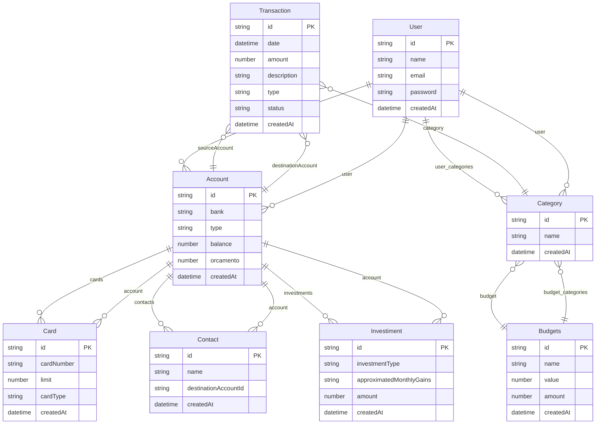

# TechFinance - TechLab 2025

## Indice

- [Primeiros Passos](#-primeiros-passos)\\
- [Tecnologias Utilizadas](#-tecnologias-utilizadas)\\
- [Estruturas do projeto](#-estruturas-do-projeto)\\
- [Decisoes da arquitetura](#-decisoes-da-arquitetura)\\
## Primeiros Passos

Primeiramente, clone o rep usando o comando:

```sh
git clone https://github.com/BrunoBianchi/Tech4Humans-Webapp-Financa.git
```

## Tecnologias Utilizadas

### Geral

- [Pnpm](https://pnpm.io/pt/) para o gerenciamento de pacotes de maneira rapida e eficiente.\\
- [Node.js](https://nodejs.org/pt) ambiente de execucao javascript\\
- [TypeScript](https://www.typescriptlang.org) uma surper class do javascript para type safety \\
- [Dotenv](https://www.npmjs.com/package/dotenv) biblioteca para a manipulacao de informacoes secretas\\
- [Docker](https://www.docker.com) para gerenciamento mais facil das aplicacoes\\
- [Husky](https://typicode.github.io/husky/) para pre commits\\
- [Eslint](https://eslint.org) para analise de tipagem e problemas\\
- [Prettier](https://prettier.io) para formatagem do codigo\\
- [Jest](https://jestjs.io/pt-BR/) para testes unitarios\\

### Backend

- [Express](https://expressjs.com/pt-br/) para a criacao do servidor backend\\
- [PostgreSQL](https://www.postgresql.org) Banco de dados SQL\\
- [JsonWebToken](https://www.npmjs.com/package/jsonwebtoken) para seguranca com assinaturas digitais\\
- [TypeORM](https://typeorm.io) uma biblioteca para abstracao de sql\\
- [Cors](https://typeorm.io) biblioteca para comunicao segura entre frontend e backend\\
- [express-rate-limit](https://www.npmjs.com/package/express-rate-limit) biblioteca para limitar a quantidade de requisicoes \\
-[Zod](https://zod.dev) uma biblioteca para validacao de interface em requisicoes\\
-[Bcrypt](https://www.npmjs.com/package/bcrypt) biblioteca para fazer hash de senhas\\
- [Uid](https://www.npmjs.com/package/uid) biblioteca para criacao de id's unicos\\
-[Reflect-Metadata](https://www.npmjs.com/package/reflect-metadata) para manipulacao de objetos na criacao de decorators\\
-[Class-Validator](https://www.npmjs.com/package/class-validator) biblioteca para validacao de estruturas de classes\\
-[Nodemon](https://nodemon.io) para monitoramento e reinicializacao do servidor\\

### Frontend

- [Vite](https://vite.dev) biblioteca para cricao rapida de projetos \\
- [React](https://react.dev) biblioteca para desenvolvimento web\\
- [Reac-Router](https://reactrouter.com) biblioteca para fazer roteamento do react mais facilmente\\
- [Tailwindcss](https://tailwindcss.com) framework de css \\
- [FlowBite](https://flowbite.com) biblioteca de componentes \\
- [Mui](https://mui.com) biblioteca de componentes react\\

### Outros

- [Bruno](https://www.usebruno.com) aplicativo desktop para visualizar requisicoes\\
- [PgAdmin](https://www.pgadmin.org) SGBD (visualizacao dos dados do banco)\\
- [DockerDesktop](https://www.docker.com) facilitar a manipulacao dos containers\\
- [Vscode](https://code.visualstudio.com) como editor de codigo\\
- [Swagger](https://swagger-autogen.github.io/docs/) para criacao de documentacao da api\\

## Estrutura do Projeto

O aplicativo esta separado em um unico diretorio contendo subpastas *backend* e *frontend* contendo cada um servidores diferentes \\
Para as regras de negocio desse projeto, utilizei uma arquitetura modular tanto no backend quanto no front end


```
Desafio-Webapp-Tech4humans/
├── backend/                      # API HTTP em Node.js/TypeScript
│   ├── src/
│   │   ├── database/             # Configuração do banco, entidades, baseEntity, etc.
│   │   ├── features/             # Features e controllers REST
│   │   ├── middlewares/          # Middlewares Express
│   │   ├── utils/                # Utilitários, serviços, classes de erro
│   │   └── main.ts               # Ponto de entrada da aplicação
│   ├── coverage/                 # Relatórios de cobertura de testes
│   ├── jest.config.ts            # Configuração do Jest
│   ├── tsconfig.json             # Configuração do TypeScript
│   ├── package.json              # Dependências e scripts do backend
│   └── .env                      # Variáveis de ambiente
├── frontend/                     # Interface de usuário em React
│   ├── app/
│   │   ├── components/           # Componentes React reutilizáveis
│   │   ├── contexts/             # Context API para gerenciamento de estado
│   │   ├── hooks/                # Custom hooks
│   │   ├── screens/              # Telas/páginas da aplicação
│   │   ├── services/             # Serviços de API e utilitários
│   │   ├── types/                # Definições de tipos TypeScript
│   │   ├── root.tsx              # Root component
│   │   └── app.css               # Estilos globais
│   ├── public/                   # Assets estáticos (imagens, ícones, etc)
│   ├── jest.config.ts            # Configuração do Jest
│   ├── tsconfig.json             # Configuração do TypeScript
│   ├── vite.config.ts            # Configuração do Vite
│   ├── package.json              # Dependências e scripts do frontend
│   └── pnpm-lock.yaml            # Lockfile do pnpm
├── docs/                         # Documentação do Swagger
├── package.json                  # Configuração do monorepo (se houver)
└── pnpm-lock.yaml                # Lockfile do pnpm na raiz
```

## Decisoes da arquitetura



