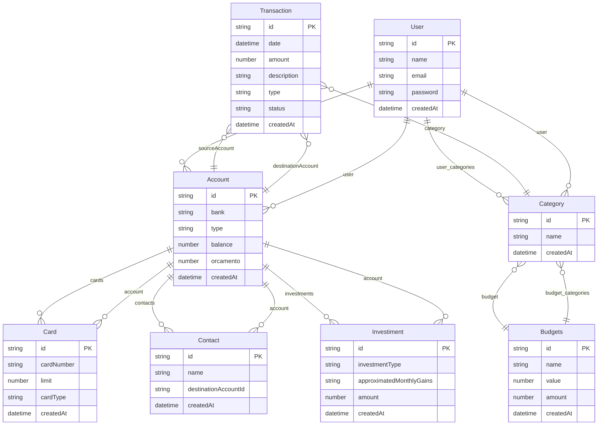

# TechFinance - TechLab 2025

Bem-vindo ao repositório do **TechFinance**, uma aplicação fullstack desenvolvida para o desafio TechLab 2025 da Tech4Humans. Este documento apresenta uma visão profissional e detalhada do projeto, incluindo decisões de arquitetura, lógica de desenvolvimento, estrutura do projeto, instruções de execução e cobertura de testes.

---

## Índice

- [Visão Geral](#visão-geral)
- [Decisões de Arquitetura](#decisões-de-arquitetura)
- [Lógica de Desenvolvimento](#lógica-de-desenvolvimento)
- [Estrutura do Projeto](#estrutura-do-projeto)
- [Tecnologias Utilizadas](#tecnologias-utilizadas)
- [Instruções de Execução](#instruções-de-execução)
- [Cobertura de Testes](#cobertura-de-testes)

---

## Visão Geral

O **TechFinance** é uma solução para gerenciamento financeiro pessoal, composta por um backend robusto em Node.js/TypeScript e um frontend moderno em React. O projeto foi estruturado para garantir escalabilidade, segurança e facilidade de manutenção.

---

## Decisões de Arquitetura

### Backend

- **TypeORM** foi escolhido como ORM por seu excelente suporte a TypeScript, integração nativa com decorators e facilidade de migração de banco de dados. Diferente de alternativas como Sequelize, o TypeORM oferece uma sintaxe mais alinhada ao padrão TypeScript e maior flexibilidade na modelagem de entidades.
- **Express** foi adotado pela sua simplicidade, flexibilidade e grande ecossistema de middlewares, facilitando a criação de APIs RESTful.
- **PostgreSQL** foi selecionado como banco de dados relacional por sua robustez, confiabilidade e recursos avançados, como transações e suporte a JSON.
- **Zod** e **Class-Validator** foram utilizados para validação de dados, garantindo integridade e segurança nas requisições.
- **JWT (JsonWebToken)** foi implementado para autenticação segura baseada em tokens.
- **Docker** foi utilizado para padronizar ambientes de desenvolvimento e facilitar o deploy.

### Frontend

- **React** foi escolhido pela sua componentização, reatividade e grande comunidade.
- **Vite** foi utilizado para acelerar o processo de build e desenvolvimento.
- **TailwindCSS** e **MUI** foram adotados para estilização rápida e consistente da interface.
- **React Router** facilita o roteamento entre páginas, promovendo uma navegação fluida.

### Outras Decisões

- **Husky**, **ESLint** e **Prettier** garantem qualidade e padronização do código.
- **Jest** foi escolhido para testes unitários, devido à sua integração com TypeScript e facilidade de uso.

---

## Lógica de Desenvolvimento

### Operações de Transferência entre Contas

A lógica de transferência garante que:

- O saldo da conta de origem seja verificado antes da transação.
- As operações sejam atômicas, utilizando transações do banco de dados para evitar inconsistências.
- Todas as transferências sejam registradas na tabela de transações, com informações detalhadas sobre origem, destino, valor e data.

### Tratamento de Erros

- Todos os endpoints possuem tratamento centralizado de erros, retornando mensagens claras e status HTTP apropriados.
- Erros de validação, autenticação e autorização são tratados separadamente para facilitar o diagnóstico e a manutenção.
- Logs de erros são gerados para monitoramento e auditoria.

---

## Estrutura do Projeto

O projeto está organizado em duas principais pastas: `backend` e `frontend`, cada uma com sua própria estrutura modular.

```
Desafio-Webapp-Tech4humans/
├── backend/                      # API HTTP em Node.js/TypeScript
│   ├── src/
│   │   ├── database/             # Configuração do banco, entidades, baseEntity, etc.
│   │   ├── features/             # Features e controllers REST
│   │   ├── middlewares/          # Middlewares Express
│   │   ├── utils/                # Utilitários, serviços, classes de erro
│   │   └── main.ts               # Ponto de entrada da aplicação
│   ├── coverage/                 # Relatórios de cobertura de testes
│   ├── jest.config.ts            # Configuração do Jest
│   ├── tsconfig.json             # Configuração do TypeScript
│   ├── package.json              # Dependências e scripts do backend
│   └── .env                      # Variáveis de ambiente
├── frontend/                     # Interface de usuário em React
│   ├── app/
│   │   ├── components/           # Componentes React reutilizáveis
│   │   ├── contexts/             # Context API para gerenciamento de estado
│   │   ├── hooks/                # Custom hooks
│   │   ├── screens/              # Telas/páginas da aplicação
│   │   ├── services/             # Serviços de API e utilitários
│   │   ├── types/                # Definições de tipos TypeScript
│   │   ├── root.tsx              # Root component
│   │   └── app.css               # Estilos globais
│   ├── public/                   # Assets estáticos (imagens, ícones, etc)
│   ├── jest.config.ts            # Configuração do Jest
│   ├── tsconfig.json             # Configuração do TypeScript
│   ├── vite.config.ts            # Configuração do Vite
│   ├── package.json              # Dependências e scripts do frontend
│   └── pnpm-lock.yaml            # Lockfile do pnpm
├── docs/                         # Documentação do Swagger
├── package.json                  # Configuração do monorepo (se houver)
└── pnpm-lock.yaml                # Lockfile do pnpm na raiz
```

---

## Tecnologias Utilizadas

### Geral

- [Pnpm](https://pnpm.io/pt/) – Gerenciamento eficiente de pacotes
- [Node.js](https://nodejs.org/pt) – Ambiente de execução JavaScript
- [TypeScript](https://www.typescriptlang.org) – Tipagem estática para maior segurança
- [Dotenv](https://www.npmjs.com/package/dotenv) – Gerenciamento de variáveis de ambiente
- [Docker](https://www.docker.com) – Padronização de ambientes
- [Husky](https://typicode.github.io/husky/) – Hooks de pré-commit
- [ESLint](https://eslint.org) & [Prettier](https://prettier.io) – Qualidade e formatação do código
- [Jest](https://jestjs.io/pt-BR/) – Testes unitários

### Backend

- [Express](https://expressjs.com/pt-br/) – Framework web
- [PostgreSQL](https://www.postgresql.org) – Banco de dados relacional
- [JsonWebToken](https://www.npmjs.com/package/jsonwebtoken) – Autenticação JWT
- [TypeORM](https://typeorm.io) – ORM para TypeScript
- [Cors](https://www.npmjs.com/package/cors) – Comunicação segura entre frontend e backend
- [express-rate-limit](https://www.npmjs.com/package/express-rate-limit) – Limitação de requisições
- [Zod](https://zod.dev) & [Class-Validator](https://www.npmjs.com/package/class-validator) – Validação de dados
- [Bcrypt](https://www.npmjs.com/package/bcrypt) – Hash de senhas
- [Uid](https://www.npmjs.com/package/uid) – Geração de IDs únicos
- [Reflect-Metadata](https://www.npmjs.com/package/reflect-metadata) – Suporte a decorators
- [Nodemon](https://nodemon.io) – Hot reload do servidor

### Frontend

- [Vite](https://vite.dev) – Build rápido
- [React](https://react.dev) – Biblioteca de UI
- [React Router](https://reactrouter.com) – Roteamento SPA
- [TailwindCSS](https://tailwindcss.com) & [MUI](https://mui.com) – Estilização e componentes
- [FlowBite](https://flowbite.com) – Componentes adicionais

### Outros

- [Bruno](https://www.usebruno.com) – Testes de API
- [PgAdmin](https://www.pgadmin.org) – Gerenciamento do banco de dados
- [Docker Desktop](https://www.docker.com) – Gerenciamento de containers
- [VSCode](https://code.visualstudio.com) – Editor de código
- [Swagger](https://swagger-autogen.github.io/docs/) – Documentação da API

---

## Instruções de Execução

### Pré-requisitos

- [Node.js](https://nodejs.org/)
- [Pnpm](https://pnpm.io/)
- [Docker](https://www.docker.com/) (opcional, mas recomendado)
- [PostgreSQL](https://www.postgresql.org/) (caso não utilize Docker)

### 1. Clone o repositório

```sh
git clone https://github.com/BrunoBianchi/Tech4Humans-Webapp-Financa.git
cd Tech4Humans-Webapp-Financa
```

### 2. Configuracao Geral

Na pasta root (Tech4Humans-Webapp-Financa), criar uma variavel chamada .env e adicionar as seguintes informacoes

```
PORT = 5000
NODE_ENV=development
FRONTEND_PORT = 5173
POSTGRES_HOST = postgres  # Caso nao use docker, trocar por localhost
POSTGRES_PORT = 5433 
POSTGRES_USER = tech4humans
POSTGRES_PASSWORD = tech4humans
POSTGRES_DB = webapp
POSTGRES_LOGS = <Boolean, para ver logs do banco>
REDIS_HOST = redis  # Caso nao use docker, trocar por localhost
REDIS_PORT = 6379
PRIVATE_KEY = <Sua chave secreta para o jwt>
```

### 2.1 (Opcional) Configuracao geral usando Docker

Na pasta root (Tech4Humans-Webapp-Financa), use os comandos do docker para criar as imagens e roda-las:

```sh
docker compose build --no-cache
docker compose up

```

### 2.2 Configuração do Backend

```sh
cd backend
cp .env.example .env
pnpm install
pnpm exec typeorm-ts-node-commonjs migration:run -d src/database/configuration/data-source.ts
pnpm run start
```

### 2.2. Configuração do Frontend

```sh
cd ../frontend
pnpm install
vite
```

## Cobertura de Testes

- **Backend:** Os testes unitários cobrem as principais regras de negócio, incluindo autenticação, operações de transferência, validação de dados e tratamento de erros. Os testes estão localizados na pasta `backend/src/__tests__` e são executados via Jest.
- **Frontend:** Componentes críticos e hooks possuem testes unitários, garantindo o correto funcionamento das telas e integração com a API.
- **Relatórios de Cobertura:** Após rodar os testes com `pnpm test`, relatórios são gerados na pasta `coverage/`, permitindo análise detalhada da cobertura.

---

## Modelo do App
A aplicacao foi desenvolvida criando um servidor frontend responsavel pelo website e consumo de api, um servidor backend responsavel pela criacao da api, conexao com o banco de dados e com redis, um servidor postgres como banco de dados e um servidor redis para criacao de filas.


### 2. Modelo do backend
O backend foi modelado utilizando uma estrutura modular para facilidade de criacao de rotas,controllers, services, classes, decorator etc. 

#### 2.1 Modelo da Api
A Api foi modelada com um padrao semelhante ao [nestjs](https://docs.nestjs.com/controllers), porem desenvolvida do zero utilizando decorators e reflect-metada


## Modelo de Dados



---

Para dúvidas ou sugestões, abra uma issue ou entre em contato!
