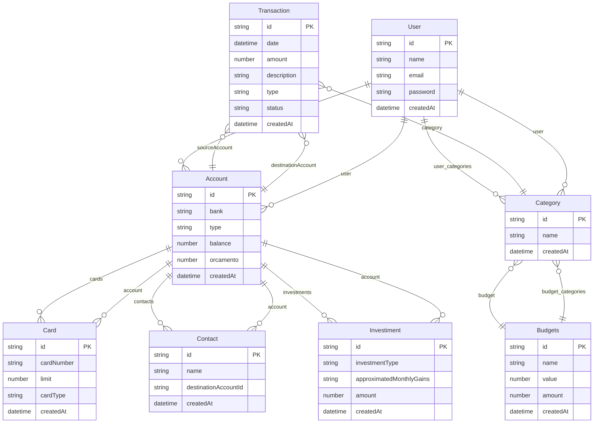

# TechFinance - TechLab 2025

## Indice

-[Primeiros Passos](#-primeiros-passos)
-[Tecnologias Utilizadas](#-tecnologias-utilizadas)

## Primeiros Passos

Primeiramente, clone o rep usando o comando:

```sh
git clone https://github.com/BrunoBianchi/Tech4Humans-Webapp-Financa.git
```

## Tecnologias Utilizadas

### Geral
- [Pnpm](https://pnpm.io/pt/) para o gerenciamento de pacotes de maneira rapida e eficiente.
- [Dotenv](https://www.npmjs.com/package/dotenv) biblioteca para a manipulacao de informacoes secretas
- [Docker](https://www.docker.com) para gerenciamento mais facil das aplicacoes
- [Husky](https://typicode.github.io/husky/) para pre commits
- [Eslint](https://eslint.org) para analise de tipagem e problemas 
- [Prettier](https://prettier.io) para formatagem do codigo
- [Jest](https://jestjs.io/pt-BR/) para testes unitarios

### Backend
- [Express](https://expressjs.com/pt-br/) para a criacao do servidor backend
- [PostgreSQL](https://www.postgresql.org) Banco de dados SQL
- [JsonWebToken]("https://www.npmjs.com/package/jsonwebtoken") para seguranca com assinaturas digitais
- [TypeORM](https://typeorm.io) uma biblioteca para abstracao de sql 
- [Cors](https://typeorm.io) biblioteca para comunicao segura entre frontend e backend
- [express-rate-limit](https://www.npmjs.com/package/express-rate-limit) biblioteca para limitar a quantidade de requisicoes 

