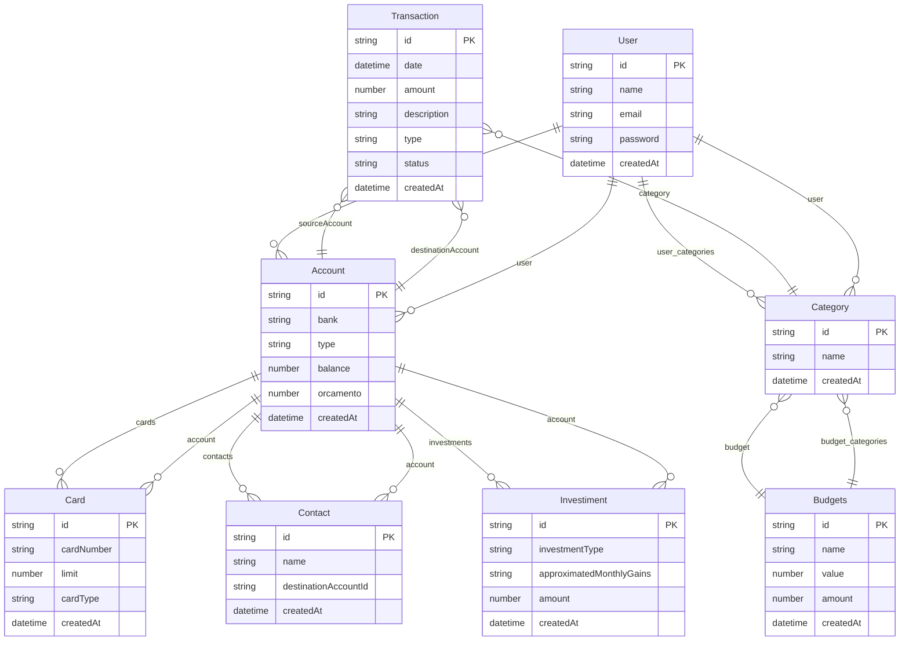

```mermaid
erDiagram

    User ||--o{ Account : "accounts" 
    Account }o--|| User : "user" 
        
    User ||--o{ Category : "user_categories" 
    Category }o--|| User : "user" 

    Account ||--o{ Card : "cards" 
    Card }o--|| Account : "account" 

    Account ||--o{ Contact : "contacts"
    Contact }o--|| Account : "account"

    Account ||--o{ Investiment : "investments"
    Investiment }o--|| Account : "account"
        
    Transaction }o--|| Account : "sourceAccount" 
    Transaction }o--|| Account : "destinationAccount" 
    Transaction }o--|| Category : "category" 

    %% Card não tem mais relação com Payment aqui
        
    Budgets ||--o{ Category : "budget_categories"
    Category }o--|| Budgets : "budget"

    User {
        string id PK
        string name
        string email
        string password
        datetime createdAt
    }
    Account {
        string id PK
        string bank
        string type
        number balance
        number orcamento
        datetime createdAt
    }
    Card {
        string id PK
        string cardNumber
        number limit
        string cardType
        datetime createdAt
    }
    Transaction {
        string id PK
        datetime date
        number amount
        string description
        string type
        string status
        datetime createdAt
    }
    Contact {
        string id PK
        string name
        string destinationAccountId
        datetime createdAt
    }
    Investiment {
        string id PK
        string investmentType
        string approximatedMonthlyGains
        number amount
        datetime createdAt
    }
    Budgets {
        string id PK
        string name
        number value
        number amount
        datetime createdAt
    }
    Category {
        string id PK
        string name
        datetime createdAt
    }
    %% Bloco da entidade Payment removido
```